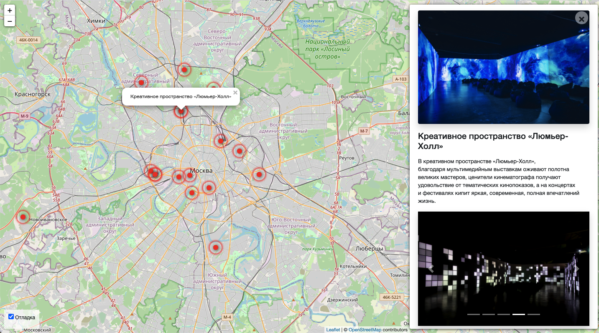

# Аналог Я.Афиши
Это сайт с картой, на которой отмечены места куда можно сходить и провести отлично время. Нажмите на точку и откроется окошечко, где будут фотографии места и подробное описание этого места ;)

[Демо-сайт](http://asultanbek.pythonanywhere.com/)  
[Aдминка демо-сайта](http://asultanbek.pythonanywhere.com/admin/places/place/) - тут можно добавить новое место или отредактировать старое (логин и пароль по запросу)

## Запуск

- Скачайте код
- Установите зависимости командой `pip install -r requirements.txt`
- Создайте БД командой `python3 manage.py migrate`
- Запустите сервер командой `python3 manage.py runserver`

## Переменные окружения

Часть настроек проекта берётся из переменных окружения. Чтобы их определить, создайте файл `.env` рядом с `manage.py` и запишите туда данные в таком формате: `ПЕРЕМЕННАЯ=значение`.

Доступны 3 переменные:
- `DEBUG` — дебаг-режим. Поставьте `True`, чтобы увидеть отладочную информацию в случае ошибки.
- `SECRET_KEY` — секретный ключ проекта
- `DATABASE_NAME` — путь до базы данных, например: `schoolbase.sqlite3`
- `STATIC_ROOT` - название папки, в которой будет лежать статика, например: `assets`

## Цели проекта

Тестовые данные взяты с сайта [KudaGo](https://kudago.com).

Код написан в учебных целях — это урок в курсе по Python и веб-разработке на сайте [Devman](https://dvmn.org).

